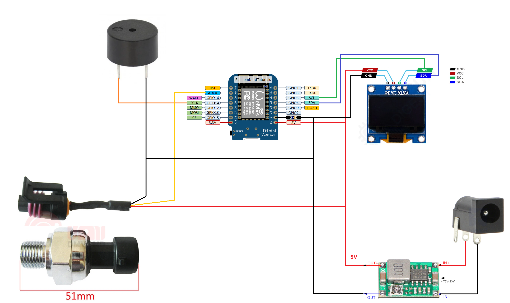

# ESP Pressure Transducer

PlatformIO project for a Wemos D1 mini (ESP8266) pressure monitor with:

- 0.96 inch I2C OLED status display
- web configuration page with in-firmware fallback if LittleFS content is missing
- Wi-Fi station mode plus fallback configuration access point
- captive portal behavior for easier AP setup on phones and laptops
- MQTT publishing for Home Assistant
- buzzer alarm for high pressure

## Hardware

Board and connections used by this project:

- Wemos D1 mini / ESP8266
- OLED SCL -> D1 / GPIO5
- OLED SDA -> D2 / GPIO4
- Buzzer -> D5 / GPIO14
- Pressure sensor output -> 10K series resistor -> A0
- A0 -> 33K resistor -> GND

Configured sensor default:

- Full scale pressure: `1200 kPa` (`1.2 MPa`, `12 bar`)
- Default analog interpretation: `0.5 V` to `4.5 V` sensor output maps to `0` to `1200 kPa`

## Circuit Diagram

The wiring used for this project is shown below:



## Important Analog Note

This firmware assumes the **Wemos D1 mini A0 pin range is 0 to 3.2 V**, then reconstructs the original sensor voltage from your external `10K / 33K` divider.

That divider ratio is:

$$
V_{A0} = V_{sensor} \times \frac{33}{10 + 33} \approx 0.767 \times V_{sensor}
$$

If your sensor is powered at `5 V` and outputs up to `4.5 V`, the divided voltage is about:

$$
4.5 \times 0.767 \approx 3.45 V
$$

That is slightly above the usual safe `3.2 V` limit of a D1 mini A0 pin. If your real hardware reaches that level, reduce the divider ratio before long-term use.

## Project Layout

- [platformio.ini](platformio.ini)
- [src/main.cpp](src/main.cpp)
- [data/index.html](data/index.html)
- [.github/workflows/platformio.yml](.github/workflows/platformio.yml)

## VS Code Setup

1. Open this folder in VS Code.
2. Install the recommended extension: `PlatformIO IDE`.
3. Connect the Wemos D1 mini by USB.
4. In PlatformIO:
   1. Run `Upload` to flash the firmware.
   2. Optionally run `Upload Filesystem Image` to store [data/index.html](data/index.html) in LittleFS too.
   3. Open `Monitor` at `115200` baud if needed.

You can also use the PlatformIO toolbar buttons in the VS Code status bar.

If the PlatformIO status bar buttons are not visible, use VS Code task buttons instead:

1. Open `Terminal -> Run Task`.
2. Use one of these project tasks:
   1. `PlatformIO: Build`
   2. `PlatformIO: Upload`
   3. `PlatformIO: Upload Filesystem`
   4. `PlatformIO: Monitor`
   5. `PlatformIO: Clean`

These tasks are defined in [.vscode/tasks.json](.vscode/tasks.json) so the project remains easy to build and upload from the VS Code interface.

## Flashing Troubleshooting

If flashing fails or the CH340/CH341 serial adapter is not detected correctly on Windows, try installing the older CH341 driver included in this repository:

- [CH341SER/CH341SER.EXE](CH341SER/CH341SER.EXE)

The driver files are stored in the [CH341SER](CH341SER) folder in this git repository.

## First Boot

On first boot the device creates an access point:

- SSID: `PressureConfig-<chipid>`
- Password: `12345678`

Open:

- `http://192.168.4.1`

Many phones and laptops should also open the configuration page automatically through captive portal detection while connected to the device AP.

Set:

- Wi-Fi SSID and password
- MQTT broker host, port, username, password
- MQTT base topic
- Home Assistant discovery prefix
- sensor voltage calibration, full-scale pressure, and buzzer threshold

After saving, the device restarts automatically.

## MQTT Topics

Default base topic:

- `home/pressure-<chipid>`

Published topics:

- `<baseTopic>/state`
- `<baseTopic>/availability`

The state payload includes:

- `pressure_kpa`
- `pressure_bar`
- `sensor_voltage`
- `a0_voltage`
- `raw_adc`
- `wifi_rssi`
- `ip`
- `alarm`
- `uptime_seconds`

If Home Assistant discovery is enabled, the firmware also publishes discovery topics under:

- `homeassistant/sensor/.../config`

## GitHub Setup

This project is prepared for git and GitHub upload.

Suggested commands:

```powershell
git init
git checkout -b main
git add .
git commit -m "Initial ESP pressure transducer project"
git remote add origin https://github.com/elik745i/ESP-Pressure-Transducer.git
git push -u origin main
```

The repository already includes a GitHub Actions workflow that builds the PlatformIO project on pushes and pull requests.

## Notes

- Wi-Fi and MQTT settings are stored in LittleFS at `/config.json`.
- The web UI is compiled into firmware and can also be stored separately in LittleFS as [data/index.html](data/index.html).
- The OLED shows live pressure, Wi-Fi state, and MQTT state.
- The built-in LED uses different blink patterns for boot, AP-only mode, Wi-Fi connection attempts, Wi-Fi connected, MQTT connected, and restart pending.
